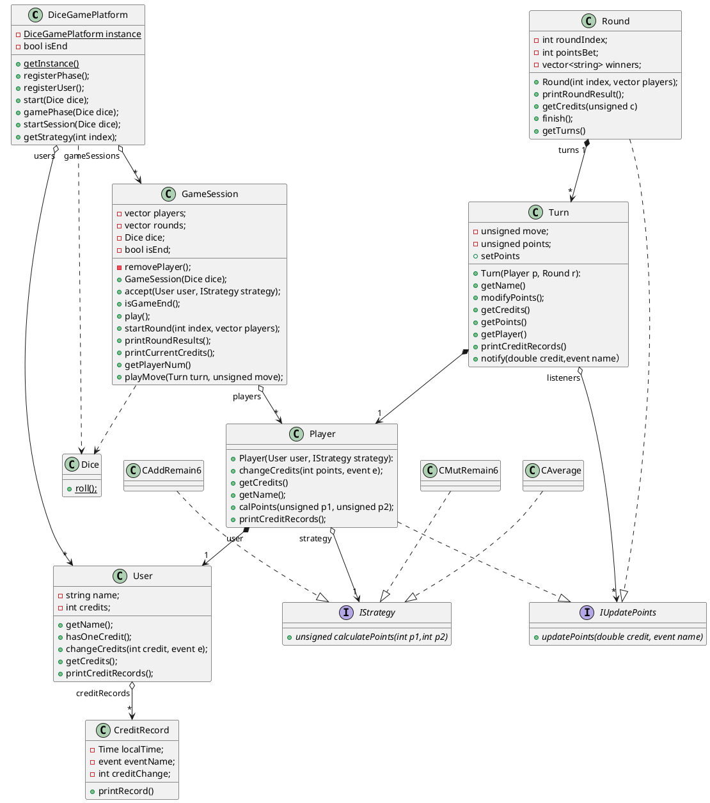

```plantuml
@startuml
class DiceGamePlatform
{
-{static} DiceGamePlatform instance
- bool isEnd
+{static} getInstance()
+ registerPhase();
+ registerUser();
+ start(Dice dice);
+ gamePhase(Dice dice);
+ startSession(Dice dice);
+ getStrategy(int index);
}
DiceGamePlatform ..> Dice
GameSession ..> Dice
DiceGamePlatform "users" o--> "*" User
DiceGamePlatform "gameSessions" o--> "*" GameSession

class User
{
- string name;
- int credits;
+ getName();
+ hasOneCredit();
+ changeCredits(int credit, event e);  
+ getCredits();
+ printCreditRecords();
}

User "creditRecords" o--> "*" CreditRecord

class CreditRecord
{
- Time localTime;
- event eventName;
- int creditChange;
+ printRecord()
}

Interface IStrategy
{
+{abstract} unsigned calculatePoints(int p1,int p2)
}
CAddRemain6..|>IStrategy
CMutRemain6..|>IStrategy
CAverage..|>IStrategy

class GameSession
{
- vector players;
- vector rounds;
- Dice dice;
- bool isEnd;
- removePlayer();
+ GameSession(Dice dice);
+ accept(User user, IStrategy strategy);
+ isGameEnd();
+ play();
+ startRound(int index, vector players);
+ printRoundResults();
+ printCurrentCredits();
+ getPlayerNum()
+ playMove(Turn turn, unsigned move);
}

GameSession "players" o--> "*" Player


class Player
{
+ Player(User user, IStrategy strategy):
+ changeCredits(int points, event e);
+ getCredits()
+ getName();
+ calPoints(unsigned p1, unsigned p2);
+ printCreditRecords();
}

Player "user" *--> "1" User
Player "strategy" o--> "1" IStrategy

class Dice
{
+{static} roll();
}

interface IUpdatePoints
{
+{abstract} updatePoints(double credit, event name)
}

class Round
{
- int roundIndex;
- int pointsBet;
- vector<string> winners;
+ Round(int index, vector players);
+ printRoundResult();
+ getCredits(unsigned c)
+ finish();
+ getTurns()
}
class Turn
{
- unsigned move;
- unsigned points;
+ Turn(Player p, Round r):
+ getName()
+ setPoints
+ modifyPoints();
+ getCredits()
+ getPoints()
+ getPlayer()
+ printCreditRecords()
+ notify(double credit,event name）
}
Turn "listeners" o--> "*" IUpdatePoints
Turn " "*-->"1" Player
Round "turns 1" *--> "*" Turn
Player..|>IUpdatePoints
Round..|>IUpdatePoints


@enduml
```

