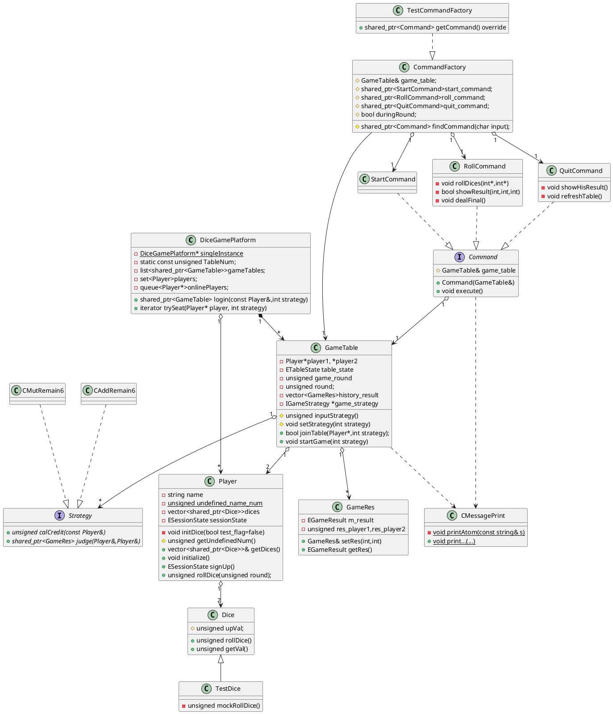

```plantuml
@startuml
class DiceGamePlatform
{
-{static} DiceGamePlatform* singleInstance
- static const unsigned TableNum;
- list<shared_ptr<GameTable>>gameTables;
- set<Player>players;
- queue<Player*>onlinePlayers;
+ shared_ptr<GameTable> login(const Player&,int strategy)
+ iterator trySeat(Player* player, int strategy)
}
Interface Strategy
{
+{abstract} unsigned calCredit(const Player&)
+{abstract} shared_ptr<GameRes> judge(Player&,Player&)
}
CAddRemain6..|>Strategy
CMutRemain6..|>Strategy
class CommandFactory
{
# GameTable& game_table;
# shared_ptr<StartCommand>start_command;
# shared_ptr<RollCommand>roll_command;
# shared_ptr<QuitCommand>quit_command;
# shared_ptr<Command> findCommand(char input);
# bool duringRound;
}

Interface Command
{
#   GameTable& game_table
+   Command(GameTable&)
+   void execute()
}
class StartCommand
{
}

class RollCommand
{
- void rollDices(int*,int*)
- bool showResult(int,int,int)
- void dealFinal()
}

class QuitCommand
{
- void showHisResult()
- void refreshTable()
}
class TestCommandFactory
{
+ shared_ptr<Command> getCommand() override
}
CommandFactory "1" o--> "1" StartCommand
CommandFactory "1" o--> "1" RollCommand
CommandFactory "1" o--> "1" QuitCommand
CommandFactory --> "1" GameTable
StartCommand..|>Command
RollCommand..|>Command
QuitCommand..|>Command
TestCommandFactory..|>CommandFactory
class GameRes
{
- EGameResult m_result
- unsigned res_player1,res_player2
+ GameRes& setRes(int,int)
+ EGameResult getRes()
}

class GameTable
{
- Player*player1, *player2
- ETableState table_state
- unsigned game_round
- unsigned round;
- vector<GameRes>history_result
- IGameStrategy *game_strategy
# unsigned inputStrategy()
# void setStrategy(int strategy)
+ bool joinTable(Player*,int strategy);
+ void startGame(int strategy)
}

class Player
{
- string name
-{static} unsigned undefined_name_num
- vector<shared_ptr<Dice>>dices
- ESessionState sessionState
- void initDice(bool test_flag=false)
# unsigned getUndefinedNum()
+ vector<shared_ptr<Dice>>& getDices()
+ void initialize()
+ ESessionState signUp()
+ unsigned rollDice(unsigned round);
}

class Dice
{
# unsigned upVal;
+ unsigned rollDice()
+ unsigned getVal()
}

class TestDice
{
- unsigned mockRollDice()
}

class CMessagePrint
{
-{static} void printAtom(const string& s)
+{static} void print...(...)
}

Dice <|-- TestDice
GameTable "1" o--> "2" Player
Player "1" o--> "2" Dice
DiceGamePlatform "1" o--> "*" Player
DiceGamePlatform "1" *--> "*" GameTable
GameTable "1" o--> "*" GameRes
GameTable "1" o--> "*" Strategy
Command ..> CMessagePrint
GameTable ..> CMessagePrint
Command "1" o--> "1" GameTable


@enduml
```

