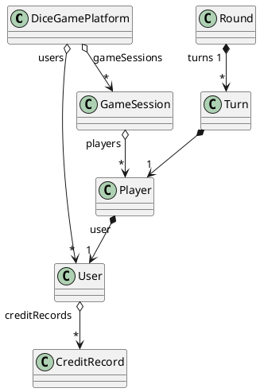

```plantuml
@startuml
DiceGamePlatform "users" o--> "*" User
DiceGamePlatform "gameSessions" o--> "*" GameSession
User "creditRecords" o--> "*" CreditRecord
GameSession "players" o--> "*" Player
Player "user" *--> "1" User
Turn " "*-->"1" Player
Round "turns 1" *--> "*" Turn

@enduml
```