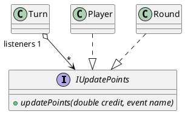

```plantuml
@startuml
interface IUpdatePoints
{
+{abstract} updatePoints(double credit, event name)
}
Turn "listeners 1" o--> "*" IUpdatePoints
Player..|>IUpdatePoints
Round..|>IUpdatePoints
@enduml
```