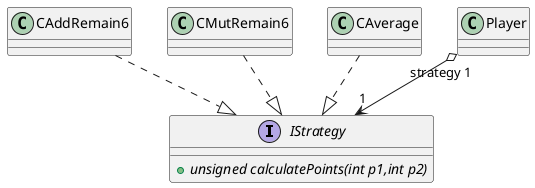

```plantuml
@startuml
Interface IStrategy
{
+{abstract} unsigned calculatePoints(int p1,int p2)
}
CAddRemain6..|>IStrategy
CMutRemain6..|>IStrategy
CAverage..|>IStrategy

Player "strategy 1" o--> "1" IStrategy
@enduml
```