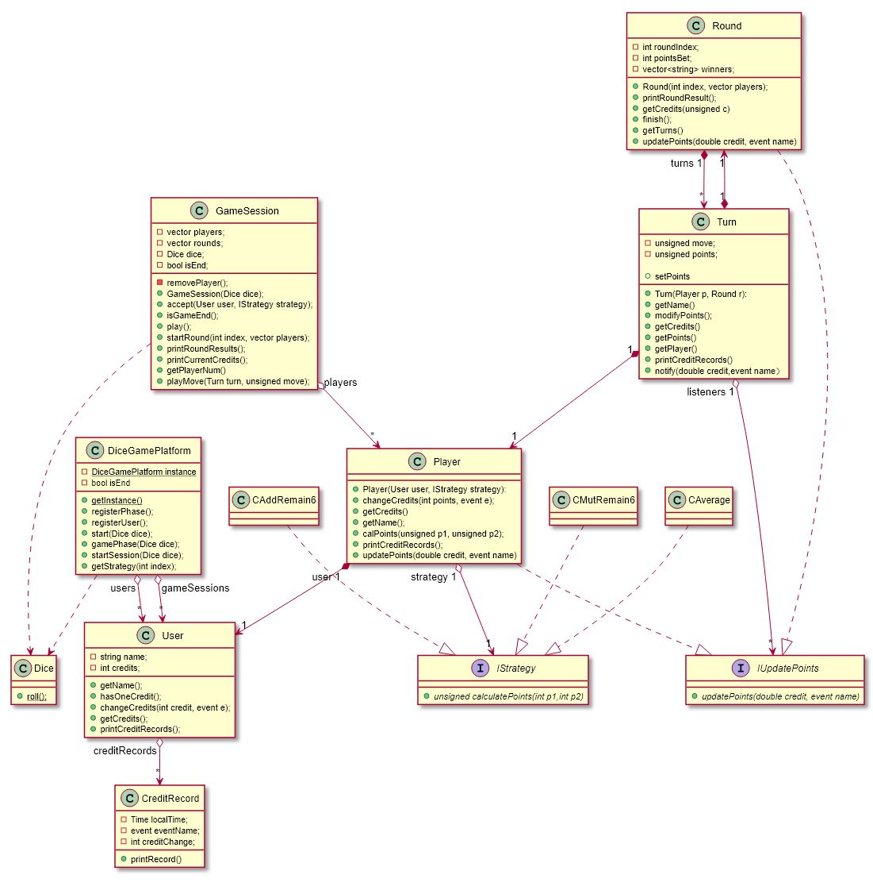
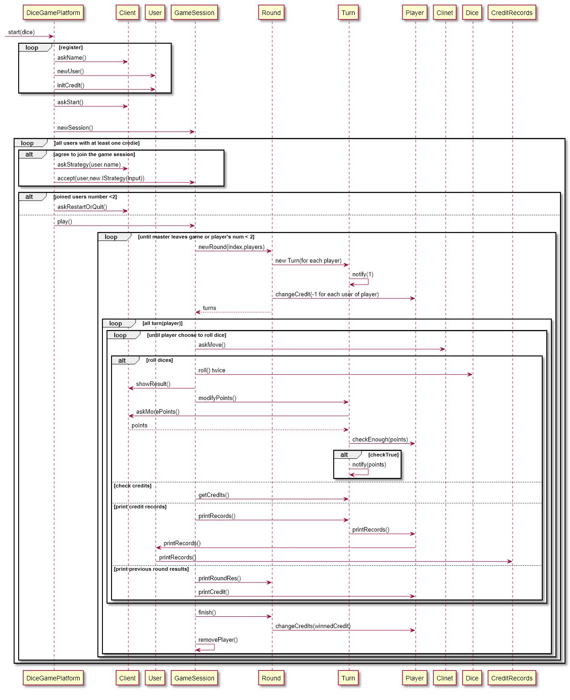
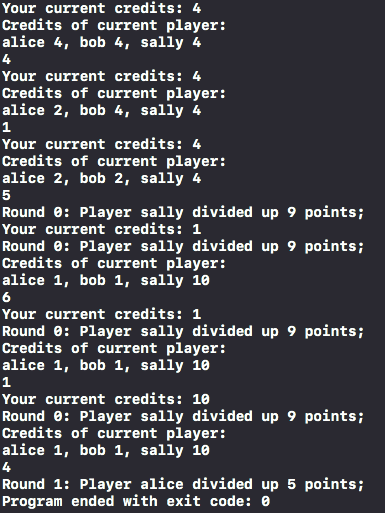

# Dice Game Final Report

### 静态设计



### 动态行为设计



### 用例测试

- 三位玩家alice, bob, sally加入游戏，分别选择加法、乘法、平均三种策略。每人每次掷骰子前首先查询自己的积分和前几轮的结果，掷骰子后都企图买1个点数。第一次三人都成功购买，第二次只有sally成功购买。
- 正确结果如第二张截图所示。

```c++
		int dice[] = {1,2,6,4,5,6,3,2,3,6,6,2};
    int i = 0;
    shared_ptr<User> u1 = make_shared<User>("alice");
    u1->changeCredits(5, REGISTER);
    shared_ptr<User> u2 = make_shared<User>("bob");
    u2->changeCredits(5, REGISTER);
    shared_ptr<User> u3 = make_shared<User>("sally");
    u3->changeCredits(5, REGISTER);
    IStrategy* s1 = new CAddRemaind6();
    IStrategy* s2 = new CMutRemaind6();
    IStrategy* s3 = new CAverage();
    const Dice d;
    GameSession* g = new GameSession(d);
    g->accept(u1, s1);
    g->accept(u2,s2);
    g->accept(u3,s3);
    for(int roundIndex  = 0; roundIndex < 2; roundIndex++){
        shared_ptr<Round> r = g->startRound(roundIndex);
        auto turns = r->getTurns();
        for(auto turn : turns){
            g->playMove(turn, 2);
            g->playMove(turn, 4);
            //1st print "Credits of current player: \nalice 4, bob 4, sally 4"
            //2nd print "Round 1: Player sally divided up 12 points;\nCredits of current player:
            //                     alice 1, bob 1, sally 13"
            unsigned p1 = dice[i++]; //1;6;5;3;3;6
            unsigned p2 = dice[i++]; //2;4;6;2;6;2
            cout<<turn->setPoints(p1,p2)<<endl; //4;1;5;6;1;4
            //all buy 1 points
            turn->modify_n(1);
        }
        r->finish();
        r->printRoundResult();
        //Round 1: Player sally divided up 9 points;
        //Round 2: Player alice divided up 5 points;
        g->removePlayer();
    }
```

