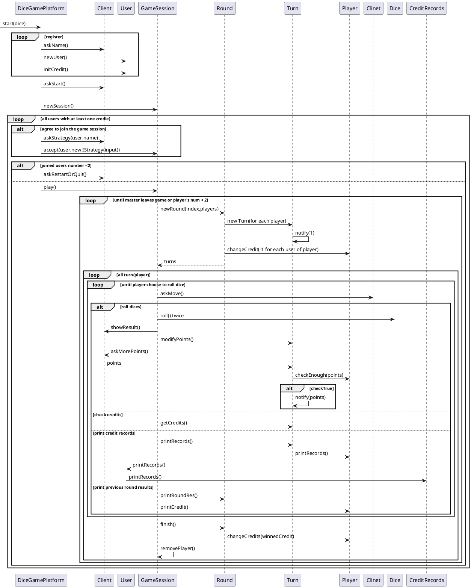

```plantuml
@startuml
[->DiceGamePlatform:start(dice)
loop register
DiceGamePlatform->Client:askName()
DiceGamePlatform->User:newUser()
DiceGamePlatform->User:initCredit()
end
DiceGamePlatform->Client:askStart()
loop game phase
DiceGamePlatform->GameSession:newSession()
loop all users with at least one credie
alt agree to join the game session
DiceGamePlatform->Client:askStrategy(user.name)
DiceGamePlatform->GameSession:accept(user,new IStrategy(input))
end
alt joined users number <2
DiceGamePlatform->Client:askRestartOrQuit()
else
DiceGamePlatform->GameSession:play()
loop until master leaves game or player's num < 2
GameSession->Round:newRound(index,players)
Round->Turn:new Turn(for each player)
Turn->Turn:notify(1)
Round->Player:changeCredit(-1 for each user of player)
Round -->GameSession:turns
loop all turn(player)
loop until player choose to roll dice
GameSession->Clinet:askMove()
alt roll dices

GameSession->Dice:roll() twice
GameSession->Client:showResult()
GameSession->Turn:modifyPoints()
Turn->Client:askMorePoints()
Client-->Turn:points
Turn->Player:checkEnough(points)
alt checkTrue
Turn->Turn:notify(points)
end

else check credits
GameSession->Turn:getCredits()

else print credit records

GameSession -> Turn:printRecords()
Turn ->Player:printRecords()
Player->User:printRecords()
User->CreditRecords:printRecords()

else print previous round results

GameSession->Round:printRoundRes()
GameSession->Player:printCredit()
end
end
GameSession->Round:finish()
Round->Player:changeCredits(winnedCredit)
GameSession->GameSession:removePlayer()
end
end
end
end
@enduml
```

