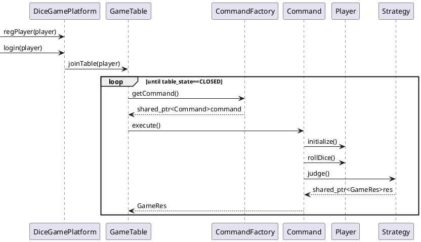

```plantuml
@startuml
[->DiceGamePlatform:regPlayer(player)
[->DiceGamePlatform:login(player)
DiceGamePlatform->GameTable:joinTable(player)
loop until table_state==CLOSED
GameTable->CommandFactory:getCommand()
CommandFactory-->GameTable:shared_ptr<Command>command
GameTable->Command:execute()
Command->Player:initialize()
Command->Player:rollDice()
Command->Strategy:judge()
Strategy-->Command:shared_ptr<GameRes>res
Command-->GameTable:GameRes
end
@enduml
```